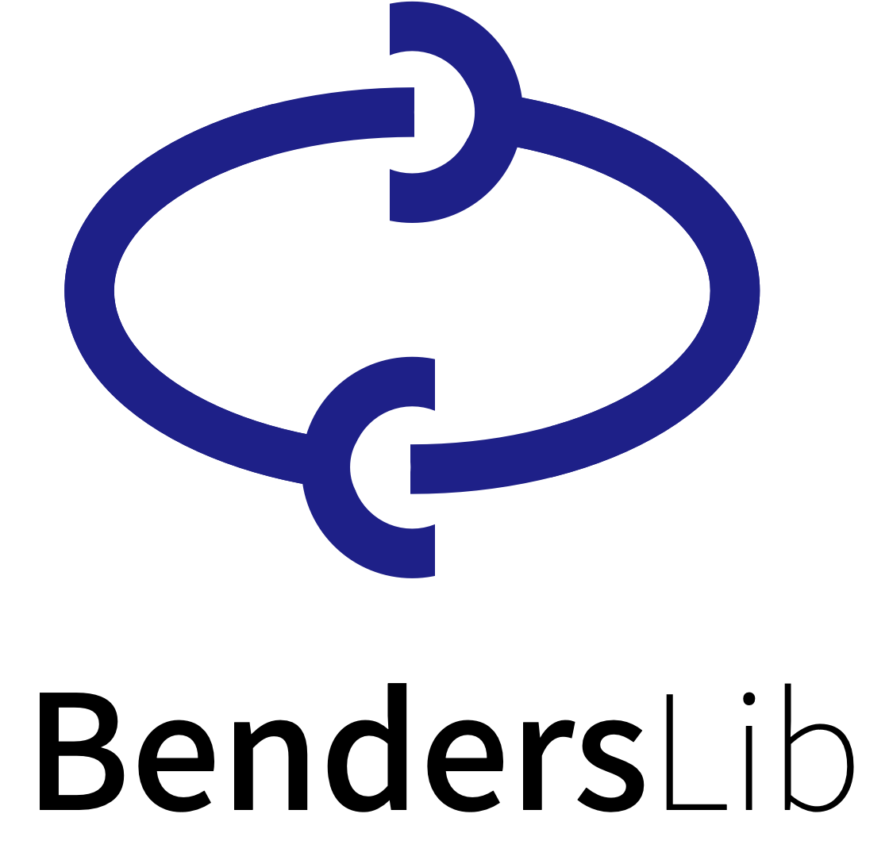
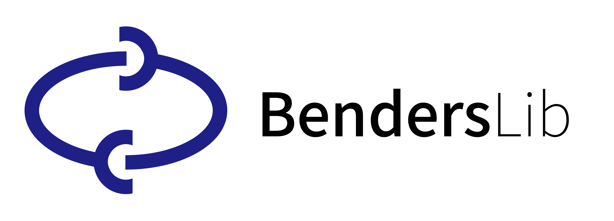

About
================================

**BendersLib** (https://benders.dev) is a Python library that supports a range of Benders decomposition variants,
including :doc:`tutorials/classical`, :doc:`tutorials/cbd`, :doc:`tutorials/lshaped`, :doc:`tutorials/ilshaped`,
:doc:`tutorials/gbd`, and :doc:`tutorials/lbbd`.
While BendersLib provides :doc:`built-in implementations of these methods <api/benders>`,
it is designed to be extensible. Users can implement custom Benders decomposition methods by
customizing :ref:`subproblem solvers <manual_custom_sub>` and :ref:`cut generators <manual_custom_cut>`,
and defining :doc:`callback functions <manual/callbacks>` for :doc:`enhancement strategies <tutorials/enhance>`.
BendersLib is solver agnostic and has :doc:`built-in interfaces <manual/solvers>` for
popular Mathematical Programming and Constraint Programming solvers.
Its support for rapid prototyping and high extensibility are designed to meet the needs of
both researchers and practitioners in Operations Research and related fields.

.. list-table::
   :widths: 25 75

   * - **Documentation**
     - `https://benders.dev <https://benders.dev>`_
   * - **GitHub Repository**
     - `https://github.com/phguo/BendersLib <https://github.com/phguo/BendersLib>`_
   * - **PyPI Package**
     - `https://pypi.org/project/BendersLib <https://pypi.org/project/BendersLib>`_
   * - **Paper**
     -

------

Contributors
--------------------------------

BendersLib was created by **Peng-Hui Guo** (郭鹏辉, https://guo.ph),
who holds a PhD in Management Science and Engineering
from Nanjing University of Aeronautics and Astronautics (NUAA), China.

*Contributions to BendersLib are welcome! If you would like to contribute, please visit*
:doc:`manual/contribution` *for more information.*

.. contributors:: phguo/BendersLib
    :avatars:
    :limit: 100

------

Citing BendersLib
--------------------------------

    Guo, PH (2025). *BendersLib: An Extensible Benders Decomposition Library in Python*. Retrieved from https://github.com/phguo/BendersLib

.. code-block:: bibtex

    @misc{Guo2025,
      author = {Guo, Peng-Hui},
      title = {BendersLib: An Extensible Benders Decomposition Library in Python},
      year = {2025},
      publisher = {GitHub},
      journal = {GitHub repository},
      howpublished = {\\url{https://github.com/phguo/BendersLib}}
    }

.. rubric:: Papers Citing BendersLib

*We update this list regularly. If you have a paper citing
BendersLib and would like it listed here, please let us know!*

------

Logo
--------------------------------

.. rubric:: Logo (vertical)

.. rubric:: Logo (horizontal)

