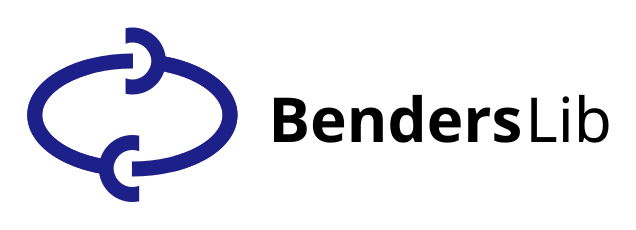

Home
===================================

*Last updated: 2025-10-06, Version: 0.1.0*

BendersLib is a powerful and extensible Python library for solving large-scale optimization problems using Benders decomposition. It provides a flexible framework for implementing various Benders decomposition variants and can be easily integrated with different solvers.

Installation
-----------------------------------
You can install BendersLib using pip:

.. code-block:: bash

    pip install benderslib

Test whether the installation is successful:

.. code-block:: python

    import benderslib
    print(benderslib.__version__)
    # Should output the version number, e.g., "0.1.0"

BendersLib requires the following packages (``requirements.txt``), which will be installed automatically.

.. code-block:: text

    gurobipy>=12.0.0

Quickstart
-----------------------------------

BendersLib make you easy to switch from a standard MIP model to Benders decomposition by only a few lines of code.
Here is a simple example of solving a gurobi MIP model with BendersLib:

.. code-block:: python
   :emphasize-lines: 17-22

    from benderslib import Gurobi, AnnotationBenders, ClassicalBenders
    from gurobipy import Model, GRB

    # Create a standard Gurobi model
    model = Model()
    x = model.addVar(name="x", vtype=GRB.INTEGER)
    y = model.addVar(name="y", vtype=GRB.CONTINUOUS)
    model.addConstr(x + y >= 15)
    model.addConstr(2 * x + 5 * y >= 30)
    model.setObjective(3 * x + 4 * y)
    model.update()

    # Complicating variable
    complicating_vars = ["x"]

    # Create and solve using Benders decomposition
    benders = AnnotationBenders(
        model,
        solver=Gurobi,
        complicating_vars=complicating_vars,
        benders=ClassicalBenders
    )
    benders.solve()
    print(f"Objective: {benders.result.obj}")
    print(f"Solution: {benders.result.solution}")

The output will be:

.. code-block:: console

    ====================================================================================
    BendersLib (v0.1.0, GPL-3.0, https://benders.dev) by Peng-Hui Guo (Copyright 2025)
    ------------------------------------------------------------------------------------
    Benders Decomposition:
     - Method:                  ClassicalBenders
     - Complicating Var. No.:   1 [Integer: 1, Binary: 0, Continuous: 0]
     - Optimality Cut:          ClassicalOCGen
     - Feasibility Cut:         ClassicalFCGen
    Master Problem:
     - Variable No.:            2 [Integer: 1, Binary: 0]
     - Constraint No.:          0
     - Solver:                  Gurobi
    Sub Problem:
     - Variable No.:            1 [Integer: 0, Binary: 0]
     - Constraint No.:          2
     - Solver:                  Gurobi
    Benders Parameters:
     - All default
    ------------------------------------------------------------------------------------
           Iter.,           LB,           UB,         Obj.,       Gap(%),   Runtime(s)
    ------------------------------------------------------------------------------------
               1,         0.00,        60.00,        60.00,       100.00,         0.00
    ------------------------------------------------------------------------------------
    Benders Result:
      - Status:                  OPTIMAL
      - Incumbent:               45.0000
      - Bound:                   45.0000
      - Gap (abs.):              0.0000
      - Gap (rel.):              0.00%
      - Solutions No.:           2
      - Iteration No.:           2
      - Cuts No.:                1 [Optimality: 1, Feasibility: 0]
      - Solve Time (sec.):       0.01 [Master: 0.01, Sub: 0.00]
    ====================================================================================
    Objective: 45.0
    Solution: {'x': 15.0, 'y': 0.0}

Features
-----------------------------------

BendersLib supports several Benders decomposition variants and enhancements,
with interfaces to popular solvers.

**Benders Decomposition Variants:**

*   Annotation Benders Decomposition: :ref:`Implementation <api-annotation>`, :doc:`Example <examples/annotation_benders>`
*   Classical Benders Decomposition: :doc:`Tutorial <tutorials/classical>`, :ref:`Implementation <api-classical>`, :doc:`Example <examples/classical_benders>`
*   Combinatorial Benders Decomposition: :doc:`Tutorial <tutorials/cbd>`, :ref:`Implementation <api-cbd>`, :doc:`Example <examples/cbd>`
*   L-shaped Method: :doc:`Tutorial <tutorials/lshape>`, :ref:`Implementation <api-lshape>`, :doc:`Example <examples/lshape>`
*   Integer L-shaped Method: :doc:`Tutorial <tutorials/ilshape>`, :ref:`Implementation <api-ilshape>`, :doc:`Example <examples/ilshape>`
*   **Customizing your own Benders Decomposition**: :doc:`Example <examples/custom_template>`

The variants supported are not limited to the above.
Since BendersLib is designed to be extensible, allowing users to implement their own Benders cuts.
Please see :doc:`examples/index` for more information.

**Enhancements:**

*   Pareto-Optimal Cuts

**Built-in Solvers Interfaces:**

*   Gurobi: :ref:`API Reference <api-gurobi>`

Structure
-----------------------------------

This documentation is structured into several sections:

*   :doc:`tutorials/index`: Background knowledge of Benders decomposition methods.
*   :doc:`manual/index`: Detailed explanations of the core concepts, components, and architecture of the library.
*   :doc:`api/index`: The complete API documentation for all public classes and functions.
*   :doc:`examples/index`: A gallery of standalone examples that you can run and modify.
*   :doc:`release`: A log of all changes, new features, and bug fixes for each version.
*   :doc:`about`: Information about the project, its authors, and how to contribute.

The BendersLib project is organized as follows:

*   ``benderslib/``: The core source code of the library, which includes:

    *   ``core.py``: The central module containing the main Benders decomposition loop and base classes.
    *   ``benders.py``: Implementations of different Benders decomposition variants like `ClassicalBenders`.
    *   ``annotation.py``: The logic for the automatic decomposition feature.
    *   ``cut.py``: Module for defining Benders cuts.
    *   ``cut_manager.py``: Module for managing Benders cuts.
    *   ``solver/``: A sub-package containing interfaces to different solvers.
    *   ``params.py``: Data classes for configuring the decomposition process.
    *   ``constants.py``: Definitions of constants used throughout the library.

*   ``docs/``: Contains the documentation source files.
*   ``examples/``: A collection of scripts demonstrating various features.
*   ``tests/``: The test suite for ensuring code quality and correctness.

Citing BendersLib
-----------------------------------

If you use BendersLib in your research, please cite it as follows:

Guo, PH (2025). *BendersLib: An Extensible Benders Decomposition Library in Python*. Retrieved from https://github.com/phguo/BendersLib

.. code-block:: bibtex

    @misc{Guo2025,
      author = {Guo, Peng-Hui},
      title = {BendersLib: An Extensible Benders Decomposition Library in Python},
      year = {2025},
      publisher = {GitHub},
      journal = {GitHub repository},
      howpublished = {\\url{https://github.com/phguo/BendersLib}}
    }

License
-----------------------------------

BendersLib is licensed under the `GPL-3.0 License <https://www.gnu.org/licenses/gpl-3.0.en.html>`__.

.. note::
   **What does this mean?**

   *  You can use BendersLib for free, even for commercial purposes.
   *  If you distribute BendersLib or its derivatives, the source code must be also available under the GPL-3.0 License.

Contents
-----------------------------------

.. toctree::
   :maxdepth: 4

   self
   tutorials/index.rst
   manual/index.rst
   api/index.rst
   examples/index.rst
   release.rst
   about.rst

.. toctree::
   :caption: Links
   :maxdepth: 1
   :hidden:

   Getting Help <https://github.com/phguo/BendersLib/issues?q=is%3Aissue>
   BendersLib@GitHub <https://github.com/phguo/BendersLib>
   BendersLib@PyPI <https://pypi.org/project/BendersLib/>
   Author's Website <https://guo.ph>
